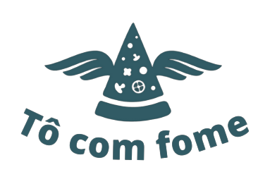

 


## Descrição

Tudo que você precisa na hora fome em um só lugar! Com o APP TôComFome desenvolvido pelo Grupo 01 da Turma15 da RESILIA Educação você consegue realizar um cadastro ou selecionar qualquer item nas seguintes categorias:

* [ESTABELECIMENTO]
* [PRODUTO]
* [CLIENTE]
* [PEDIDO]
* [ENTREGADOR]


## Demonstração

  --


## Screenshots

  --


## Funcionalidades

-  Qualquer ESTABELECIMENTO pode se cadastrar na plataforma enviando:

     - [x]  ID
     - [x]  NOME
     - [x]  TELEFONE
     - [x]   EMAIL
     - [x]   SENHA
     - [x]   ENDEREÇO

- Qualquer um pode cadastrar um PRODUTO na plataforma enviando:
    
     - [x]   ID
     - [x]   NOME
     - [x]   MARCA
     - [x]   INGREDIENTES
     - [x]   QUANTIDADE
     - [x]   PREÇO
     - [x]   VALIDADE

- Qualquer CLIENTE pode se cadastrar na plataforma enviando:

     - [x]   ID
     - [x]   NOME
     - [x]   IDADE
     - [x]   TELEFONE
     - [x]   EMAIL
     - [x]   SENHA
     - [x]   ENDEREÇO
     - [x]   FAVORITOS

- Qualquer um pode cadastrar um PEDIDO na plataforma enviando:
  
     - [x]   ID
     - [x]   NOME (CLIENTE)
     - [x]   NOME (ESTABELECIMENTO)
     - [x]   NOME (PRODUTOS)
     - [x]   NOME (ENTREGADOR)
     - [x]   QUANTIDADE (PRODUTOS)
     - [x]   PREÇO (PRODUTOS)

- Qualquer ENTREGADOR pode se cadastrar na plataforma enviando:
     
     - [x]   ID
     - [x]   NOME
     - [x]   CPF
     - [x]   TELEFONE
     - [x]   IDADE
     - [x]   LOCALIZAÇÃO
     - [x]   EMAIL
     - [x]   SENHA
     - [x]   MEIO DE TRANSPORTE

---


## Documentação da API

#### Retorna todos os itens

```http
  GET /api/items
```

| Parâmetro   | Tipo       | Descrição                           |
| :---------- | :--------- | :---------------------------------- |
| `api_key` | `string` | **Obrigatório**. A chave da sua API |

#### Retorna um item

```http
  GET /api/items/${id}
```

| Parâmetro   | Tipo       | Descrição                                   |
| :---------- | :--------- | :------------------------------------------ |
| `id`      | `string` | **Obrigatório**. O ID do item que você quer |


## Deploy

Para fazer o deploy desse projeto rode

```bash
  npm run deploy
```


## Instalação

Instale my-project com npm

```bash
  npm install my-project
  cd my-project
```
    
## Contribuindo

Contribuições são sempre bem-vindas!

Veja `contribuindo.md` para saber como começar.

Por favor, siga o `código de conduta` desse projeto.


## Rodando os testes

Para rodar os testes, rode o seguinte comando

```bash
  npm run test
```


## Uso/Exemplos

```javascript
import Component from 'my-project'

function App() {
  return <Component />
}
```


## Stack utilizada

**Front-end:** React, Html, CSS

**Back-end:** Node, Express

**Utilitários:** Visual Studio Code, Insomnia


## SoftSkills

O que você aprendeu construindo esse projeto? Quais desafios você enfrentou e como você superou-os?


## Autores

- [Breno Garduci](https://github.com/Garduciz)
- [Hugo Legramandi](https://www.github.com/hugolegramandi)
- [Laura Castro](https://github.com/Lauracastro27)
- [Luana Maximiano](https://github.com/Luana-Developer)
- [Rafael Silva](https://github.com/Rafael753)


## Referência

 - [Awesome Readme Templates](https://awesomeopensource.com/project/elangosundar/awesome-README-templates)
 - [Awesome README](https://github.com/matiassingers/awesome-readme)
 - [How to write a Good readme](https://bulldogjob.com/news/449-how-to-write-a-good-readme-for-your-github-project)


## Licenças

[](https://github.com/tterb/atomic-design-ui/blob/master/LICENSEs)
[](https://opensource.org/licenses/)
[](http://www.gnu.org/licenses/agpl-3.0)

